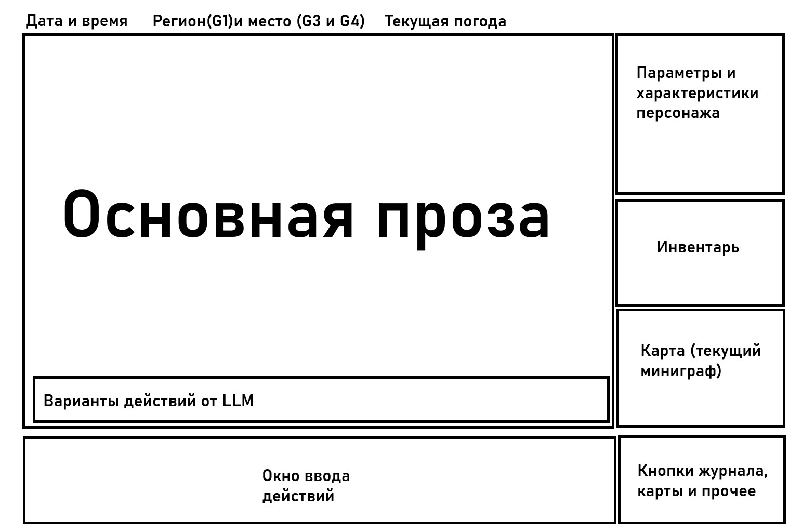

# UI kit: устройство game-web

> status: REFERENCE / DOMAIN GUIDE; при конфликте действует governing-корпус (AGENTS.md) или профильный контракт. Проверено: 2026-09-22, commit c5501419.

Карта browser-клиента `apps/game-web`. Владелец и инварианты — [apps/game-web/MODULE.md](../../apps/game-web/MODULE.md);
read models для экрана — [packages/presentation/MODULE.md](../../packages/presentation/MODULE.md) (`@rus/presentation`);
машинные запреты — [check-boundaries.mjs](../../tools/architecture/check-boundaries.mjs). Общий UX-гид корпуса —
[interface_ux.md](../../data/knowledge-source/corpus/DOCUMENTS/interface_ux.md) (статус `UNDECLARED / DOMAIN GUIDE`
в [CONTRACT_INDEX](../../data/knowledge-source/corpus/DOCUMENTS/CONTRACT_INDEX.md)).

## 1. Устройство

- Vanilla JS ES-модули без фреймворка и без build-скриптов ([package.json](../../apps/game-web/package.json) содержит только `exports`): [index.html](../../apps/game-web/public/index.html) подключает
  `/styles.css` и `/src/main.js`, корень — `
`.
- Game-web получает только versioned public read models от `@rus/game-server` и не вычисляет последствия
  ([MODULE.md](../../apps/game-web/MODULE.md), [MODULE_INDEX](../../MODULE_INDEX.md)).
- Public API пакета: [src/index.js](../../apps/game-web/src/index.js) (`bootstrapGameWeb`, `createUiStore`,
  `renderScreen`, `renderAppState`, API client/validators).

| Каталог | Что внутри |
|---|---|
| `apps/game-web/src/api` | `client.js` (HTTP `/api/v1`), `contracts.js` (валидация envelopes/screens, `PUBLIC_PAYLOAD_HIDDEN_LEAK`) |
| `apps/game-web/src/app` | `bootstrap.js` (события, intent), `router.js` (единственный, кто собирает экран), `store.js`, `pending-turn.js`, `turn-submission.js`, `pending-opening-ack.js`, `overlay-focus.js`, `scene-canvas-hydration.js`, `llm-settings*.js` |
| `apps/game-web/src/features` | чистые рендереры: `actions`, `character`, `checks`, `conversation-portrait`, `current-task`, `diagnostics`, `inventory`, `journal`, `landscape`, `map`, `people`, `prose`, `routes` (каждый — `render.js`) + `panel-helpers.js` |
| `apps/game-web/src/shared` | общие утилиты (см. раздел 4) |
| `apps/game-web/src/portrait-lab` | отдельная страница `/portrait-lab`, не участвует в production path ([MODULE.md](../../apps/game-web/MODULE.md)) |
| `apps/game-web/public/assets` | authored `landscape/` и `portrait/` bitmaps; контракты — [AUTHORED_LANDSCAPE_CONTRACT.md](../../apps/game-web/AUTHORED_LANDSCAPE_CONTRACT.md), [AUTHORED_PORTRAIT_CONTRACT.md](../../apps/game-web/AUTHORED_PORTRAIT_CONTRACT.md) |

## 2. Wireframe

Файл [assets/ui-wireframe.jpg](assets/ui-wireframe.jpg) — исходный эскиз владельца (перенесён из корня, ранее
`вариант UI.jpg`). Он не контракт: в [CANONICAL_PATHS.json](../migration/CANONICAL_PATHS.json) не регистрируется.

Эскиз и текущая реализация расходятся: на эскизе персонаж, инвентарь и карта — постоянные колонки справа; в коде
([router.js](../../apps/game-web/src/app/router.js)) они открываются кнопками навигации как overlay-диалоги.

## 3. Экран и панели (по `router.js`)

Порядок `renderScreen`: header (бренд, ⚙ настройки LLM, смена темы) → `context-strip` → `panel-navigation` →
`scene-viewport-shell` (landscape + портрет собеседника + weather canvas) → `reader-column`
(current task → проза или factual block → checks → opening status → actions) → overlay.

| Зона | Рендерер | Данные |
|---|---|---|
| Контекст: Вы, Место, Дата, Время, Ход занял, Погода, Состояние | `renderContext` в router | `visible_context` + `presentation_context`, имя/роль из `panels.character` |
| Проза | `features/prose` | `main_prose` / `prose`; для `factual_turn_delivery_screen` — factual block в router |
| Проверки | `features/checks` | `screen.checks` (готовые roll/DC/outcome от сервера) |
| Действия и ввод | `features/actions` | `action_panel.suggested_actions`, `free_text_input` / `input_panel` |
| Текущая задача | `features/current-task` | `panels.journal.data.current_task` |
| Сцена | `features/landscape`, `features/conversation-portrait` | `scene_asset_id`, `environment`, active interlocutor |
| Overlay «Персонаж», «Ноша», «Люди», «Путь», «Карта», «Летопись» | `character`, `inventory`, `people`, `routes`, `map` (+ `renderSceneMinimap`), `journal` | `screen.panels.<kind>` с `visible === true` |
| Overlay «Диагностика» | `features/diagnostics` | только при `developerMode` |
| Overlay «LLM» | `renderLlmSettingsOverlay` в router | `/api/v1/llm-settings` |

Состав панелей задаёт `@rus/presentation` (Character, Inventory, People, Route, Map, Journal, Diagnostic —
[presentation MODULE.md](../../packages/presentation/MODULE.md)); game-web новые панели не выдумывает.

⚠ PR #98 меняет: overlay «LLM» и стартовый экран (вместо режима локальной Gemma — только OpenAI-compatible vLLM
endpoint, без настройки кнопка «Новая игра» заблокирована), добавляет `app/pending-new-game.js`; `@rus/presentation`
начинает принимать `screen_kind` `live_world_turn`.

## 4. Хелперы, которые нельзя писать заново

| Хелпер | Экспорт | Для чего |
|---|---|---|
| [features/panel-helpers.js](../../apps/game-web/src/features/panel-helpers.js) | `renderRows`, `renderItems`, `renderEmpty`, `labelOf`, `scalar`, `stateLabel`, `listItem` | списки, пары label/value, пустые состояния; уже используется в character, inventory, people, routes, map, journal |
| [shared/escape-html.js](../../apps/game-web/src/shared/escape-html.js) | `escapeHtml` | экранирование любого текста в HTML-строке |
| [shared/errors.js](../../apps/game-web/src/shared/errors.js) | `GameWebError`, `webError` | типизированные ошибки клиента |
| [shared/scene-affordances.js](../../apps/game-web/src/shared/scene-affordances.js) | allowlists landscape, `validCurrentTask`, `validActiveInterlocutor`, `validLandscapeContext`, `normalizeLandscape*` | закрытые значения сцены |
| [shared/deterministic-random.js](../../apps/game-web/src/shared/deterministic-random.js) | `deterministicUnit`, `hashDeterministicValue` | детерминированная вариативность рисования (`Math.random(` в game-web запрещён check-boundaries) |
| [shared/handmade-canvas.js](../../apps/game-web/src/shared/handmade-canvas.js) | `strokeHandmade`, `fillHandmadePatch`, точки кривых | «рукописный» Canvas-стиль |
| [shared/image-cache.js](../../apps/game-web/src/shared/image-cache.js) | `loadImage` | загрузка asset-изображений |
| [api/contracts.js](../../apps/game-web/src/api/contracts.js) | валидаторы public screen | единственная проверка входящих payload |

## 5. Правила для рендереров

| Правило | Источник |
|---|---|
| Feature renderers — чистые функции; корневой DOM заменяет только app router | [MODULE.md](../../apps/game-web/MODULE.md), «Инварианты» |
| В `apps/game-web/src/features/**` запрещены `document.`, `querySelector`, `innerHTML =` | check-boundaries: «feature renderer may not mutate DOM directly» |
| Во всём `apps/game-web/src` запрещены строка `@rus/`, `legacy/`, `pg`, SQL, `Math.random(`; внешние импорты кроме `node:` не одобрены (пустой allowlist) | check-boundaries, блок `game-web` |
| Game-web не импортирует `game-server` | check-boundaries; [DEPENDENCY_RULES](../architecture/DEPENDENCY_RULES.md) |
| Файл в `apps/*/src` — не более 300 строк и 25 КБ | check-boundaries (⚠ PR #98 меняет: становятся warnings) |
| Hidden/private/write-plan/audit поле в payload блокирует обновление UI | [MODULE.md](../../apps/game-web/MODULE.md); [CONTRACT_POLICY](../architecture/CONTRACT_POLICY.md) «Hidden/visible boundary» |
| Ввод игрока отправляется как intent (`intent_not_fact`), не как факт | MODULE.md; check-boundaries проверяет `bootstrap.js` и `contracts.js` |
| Браузер не бросает кубик и не считает total/outcome | MODULE.md, «Инварианты» |

## 6. CSS-переменные ([styles.css](../../apps/game-web/public/styles.css))

Светлая тема — `:root`, тёмная — `:root[data-theme="dark"]` (тот же набор цветовых токенов).

| Токен | Назначение (по имени и применению) |
|---|---|
| `--paper`, `--paper-raised`, `--paper-muted` | фон страницы, приподнятых и приглушённых поверхностей |
| `--ink`, `--ink-muted` | основной и вторичный текст |
| `--line`, `--line-soft` | границы и тонкие разделители |
| `--cinnabar`, `--cinnabar-hover` | акцент (основные кнопки) и его hover |
| `--brass` | вторичный акцент |
| `--shadow` | цвет теней |
| `--focus` | кольцо фокуса |
| `--font-display`, `--font-body`, `--font-ui` | шрифты заголовков, прозы и интерфейса (только в `:root`) |

Тесты UI: `apps/game-web/test` (`npm run test:apps`), браузерный e2e — `test/e2e` (`npm run test:browser-e2e`).
